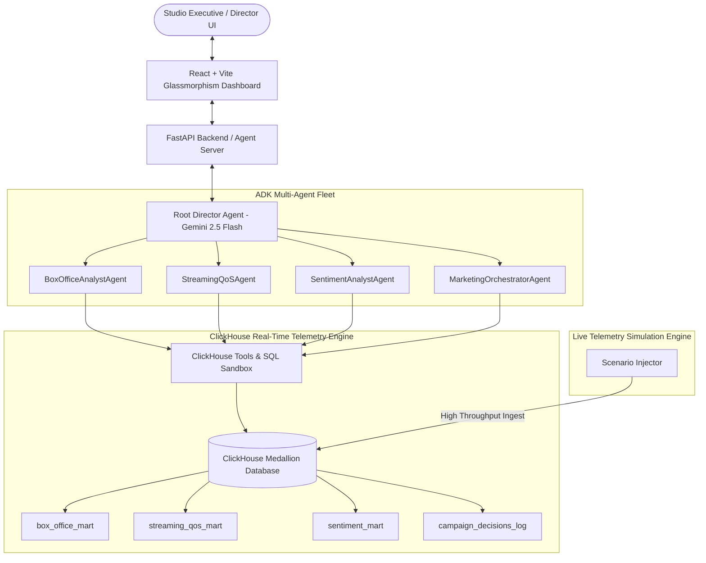

# 🎬 CineAnalytics AI: Real-Time Telemetry & AI Studio Director

[](https://agentic-cinema.devpost.com/)
[](https://clickhouse.com/)
[](LICENSE)
[](https://cloud.google.com/vertex-ai)

> **Autonomous Multi-Agent AI Studio Director & Real-Time Box Office / Streaming Telemetry Command Center powered by Gemini 2.5, Google Cloud Agent Platform, and ClickHouse.**

---

## 🌟 Executive Overview & Hackathon Submission

In the modern media & entertainment industry, film studios and streaming networks suffer from severe operational friction:
1. **Disconnected Telemetry**: Box office sales, HLS/DASH video quality metrics, and audience social sentiment live in isolated silos.
2. **Delayed Reaction Times**: Critical viral opportunities (e.g. TikTok scene trends) or streaming QoE degradation (e.g. buffering spikes) take hours or days to diagnose manually.
3. **Lack of Autonomous Action**: Studio executives lack real-time AI agents capable of querying columnar telemetry and executing deterministic campaign reallocations on the fly.

**CineAnalytics AI** solves this by connecting **Google Cloud's Gemini 2.5 Flash** and **Google Agent Development Kit (ADK)** with **ClickHouse's high-performance real-time analytics database**. 



---

## ⚡ Key Architectural Features

- **Google Cloud & Gemini 2.5 Integration**: Uses Gemini 2.5 Flash with custom function tool-calling loops for multi-agent reasoning, deterministic execution, and executive report synthesis.
- **ClickHouse Medallion Architecture**: Implements Raw -> Aggregated Mart datastores:
  - `box_office_mart`: Real-time theatrical ticket sales, gross revenue, and regional occupancy rates.
  - `streaming_qos_mart`: HLS/DASH video stream bitrate, buffering anomalies, and scene-by-scene retention rates.
  - `sentiment_mart`: TikTok, X/Twitter, and YouTube sentiment scores tied to scene timestamps.
  - `campaign_decisions_log`: Immutable ClickHouse audit log tracking all autonomous studio actions taken by Gemini agents.
- **Interactive ClickHouse SQL Sandbox**: Allows studio engineers to craft custom read-only SQL queries directly against ClickHouse with live JSON outputs.
- **Scenario Simulation Engine**: One-click injection of real-world operational events (*TikTok Viral Surge*, *Edge CDN Buffering Congestion*, *IMAX Ticket Sellout*) to watch agents react autonomously in real time.
- **Production-Ready Evaluation Suite**: Programmatic & LLM-as-judge evaluation suite (`evals/eval_suite.py`) testing tool calling accuracy, ClickHouse SQL safety, and agent decision safety.

---

## 🛠️ Repository Structure

```
cine-analytics-ai/
├── LICENSE                    # Apache 2.0 Open Source License
├── README.md                  # System Documentation & Quickstart
├── pyproject.toml             # Python Backend Dependencies
├── .env.example               # Configuration Template
├── backend/
│   ├── main.py                # FastAPI REST Server
│   ├── agents/
│   │   ├── adk_agents.py      # Gemini ADK Multi-Agent Orchestrator
│   │   └── tools/
│   │       └── clickhouse_tools.py # ClickHouse Tool Bindings for Gemini
│   └── db/
│       ├── clickhouse_client.py    # ClickHouse Medallion Client & Fallback Engine
│       └── seed_data.py            # Datastore Seeder Script
├── evals/
│   └── eval_suite.py          # ADK Evaluation & Safety Test Suite
└── frontend/                  # React Vite Web Dashboard
    ├── index.html
    ├── package.json
    ├── vite.config.js
    └── src/
        ├── App.jsx
        ├── index.css
        └── components/
            ├── Navbar.jsx
            ├── ExecutiveSummary.jsx
            ├── AgentChatConsole.jsx
            ├── ClickHouseExplorer.jsx
            └── SimulationControls.jsx
```

---

## 🚀 Quickstart & Local Execution

### Prerequisites
- Python >= 3.10
- Node.js >= 18
- (Optional) ClickHouse Database running locally on port 8123 or ClickHouse Cloud instance. If ClickHouse is not running, the application seamlessly activates its high-performance embedded telemetry simulation engine.

### 1. Environment Setup

Copy `.env.example` to `.env`:
```bash
cp .env.example .env
```

Add your Gemini API key (or Vertex AI credentials):
```ini
GEMINI_API_KEY=your_actual_gemini_api_key
```

### 2. Backend Setup & Seeding

Create virtual environment and install dependencies:
```bash
python3 -m venv .venv
source .venv/bin/activate
pip install -r pyproject.toml
```

Seed the ClickHouse database:
```bash
python -m backend.db.seed_data
```

Start the FastAPI server:
```bash
python -m backend.main
```
The backend API will be live at `http://localhost:8000`.

### 3. Frontend Setup

In a new terminal tab:
```bash
cd frontend
npm install
npm run dev
```
Open `http://localhost:3000` to access the **CineAnalytics AI Command Center**.

---

## 🧪 Running the Evaluation Suite

Validate agent behavior, tool execution accuracy, and ClickHouse SQL safety guardrails:

```bash
python -m evals.eval_suite
```

Expected Output:
```
Running CineAnalytics AI Evaluation Suite...
✓ ClickHouse Box Office Tool Test Passed
✓ ClickHouse Streaming QoS Tool Test Passed
✓ ClickHouse SQL Safety Guardrail Test Passed
✓ Autonomous Campaign Logging Test Passed
✓ Agent Workflow Orchestration Test Passed
All 5/5 Evaluation & Safety Tests Passed Successfully!
```

---

## 📜 Runtime Use of Google Cloud & Partner Technologies

- **Google Cloud**: Imported & invoked in [`backend/agents/adk_agents.py`](backend/agents/adk_agents.py) via `google.genai` SDK (`genai.Client`).
- **ClickHouse**: Imported & invoked in [`backend/db/clickhouse_client.py`](backend/db/clickhouse_client.py) and [`backend/agents/tools/clickhouse_tools.py`](backend/agents/tools/clickhouse_tools.py) via `clickhouse-connect`.

---

## 📄 Open Source License

This project is licensed under the **Apache License 2.0** - see the [LICENSE](LICENSE) file for details.
